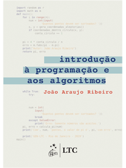

## Ementa

Introdução a algoritmos e lógica de programação. Tipos de dados básicos. Estruturas de controle: sequência, seleção e repetição. Funções e procedimentos. Estruturas de dados homogêneas e heterogêneas. Noções de complexidade de algoritmos.

## Horário

## Sala de Aula
**Segunda-feira**: LabBas  
**Quarta-feira**: 4027B

# Plano de Aulas:
# Algoritmos Computacionais I (32 Aulas)

**Livro Texto:** RIBEIRO, João Araujo. Introdução à Programação e aos Algoritmos. Rio de Janeiro: LTC, 2019.

---

## Bloco 1 – Computação Essencial (4 aulas)

*Objetivo: contextualizar sem afogar em teoria.*  

<table style="width:100%; table-layout:fixed;">
<colgroup>
  <col style="width:5%">
  <col style="width:75%">
  <col style="width:20%">
</colgroup>
<thead>
<tr><th>n&ordm;</th><th>Conteúdo Programático</th><th>Referência</th></tr>
</thead>
<tbody>
<tr><td>01</td>
<td><a href="/algcomp/aula1"><b>Apresentação do Curso:</b></a> expectativas, Avaliação Prefácio e Plano de Ensino. Importância do pensamento lógico. O que é algoritmo.</td><td>Prefácio e Plano de Ensino</td></tr>
<tr>
<td>02</td>
<td><a href="/algcomp/aula02"><b>Como o computador representa informação:</b></a>Decimal e Binário (bit/byte), Prefixos kilo, mega, giga, tera, peta. 
<b>Bases Avançadas:</b> Hexadecimal, Octal e o padrão Kibi/Kilo. 
<b>Representação de Dados:</b> caracteres (ASCII/Unicode). 
<b>Questionário:</b> números sinalizados (Complemento a 2) e ponto flutuante (para casa) 
<b>Exercícios:</b> conversão de bases manual e aritmética binária (para casa).</td>
<td> Cap. 1 (1.1-1.2) Cap. 1 (1.3-1.4) Cap. 1 (1.5-1.7)</td></tr>
<tr>
<td>03</td>
<td><a href="/algcomp/aula03"><b>Arquitetura e execução:</b></a> Modelo de Von Neumann, CPU, Memória e SO.  
<a href="/algcomp/aula03.1"><b>O Ambiente de Trabalho:</b></a> Uso do interpretador interativo vs. scripts .py.</td>
<td>Cap. 1 (1.8-1.12)  Cap. 2 (2.1)</td></tr>
<tr><td>04</td>
<td><a href="/algcomp/aula04"><b>Pensamento Algorítmico:</b></a> Definição de passos não ambíguos e refinamentos sucessivos. 
<b>Algoritmos no Papel:</b> Fluxogramas e Pseudo-código para problemas cotidianos.</td>
<td>Cap. 2 (2.2-2.3)  Cap. 2 (2.4-2.5)</td></tr>
</tbody>
</table>

---

## Bloco 2 – Fundamentos de Programação (11 aulas)

<table style="width:100%; table-layout:fixed;">
<colgroup>
  <col style="width:5%">
  <col style="width:75%">
  <col style="width:20%">
</colgroup>
<thead>
<tr><th>n&ordm;</th><th>Conteúdo Programático</th><th>Referência</th></tr>
</thead>
<tbody>
<tr><td>05</td><td><b>Bases da Programação:</b> <a href="/algcomp/aula05/5.1_identificadores.html">Identificadores</a>, <a href="/algcomp/aula05/5.2_dados.html">Dados Numéricos</a>, <a href="/algcomp/aula05/5.3_tiposeconstantes.html">Tipos e Constantes Numéricas</a>,  <a href="/algcomp/aula05/5.4_buscabinaria.html">Busca Binária</a>.</td><td>Cap. 2 (2.6-2.9). </td></tr>
<tr><td>06</td><td><b><a href="https://drive.google.com/file/d/1Zf8G0teWrhnbzmeG42SC3PnTzugwhFLZ/view?usp=sharing">Estrutura básica de programa</a>:</b> Sequência, Entrada e saída, Expressões simples</td><td>Cap. 3.1.1</td></tr>
<tr><td>07</td><td><b><a href="https://drive.google.com/file/d/1HF8bNnVzNdGzWvZzpI29UPbhLaDfvUxi/view?usp=sharing">Estruturas de decisão (if)</a>:</b> Estruturas de Seleção simples e compostas (if/else).</td><td>Cap. 3 (3.1-3.2)</td></tr>
<tr><td>08</td><td><b>Iteração:</b> While e laços contados. <b>Condições Complexas:</b> Desafios de lógica (ex: cálculo de ano bissexto).</td><td>Cap.3.1.3, Cap 3.5-3.6 Cap. 3</td></tr>
<tr><td>09</td><td><b>Laboratório de problemas reais (validação, médias, regras):</b> Exercícios com médias e validação de dados.</td><td>Cap. 3 (3.4)</td></tr>
<tr><td>10</td><td><b>Subalgoritmos:</b> Definição de funções, fluxo de execução e return.</td><td>Cap. 4 (4.1-4.3)</td></tr>
<tr><td>11</td><td><b>Parâmetros e escopo:</b> Passagem de parâmetros; Variáveis globais e locais; Funções com múltiplos retornos.</td><td>Cap. 4.4.4-4.6</td></tr>
<tr><td>12</td><td><b>Organização e módulos:</b> Módulos em Python; Reuso; Estruturação de programas maiores.</td><td>Cap 4.2 e 4.6</td></tr>
<tr><td>13</td><td><b>Módulos e Exceções:</b> Uso de math, random e tratamento de erros com try/except.</td><td>Cap. 4 (4.2, 4.7)</td></tr>
<tr><td>14</td><td><b>Exercícios e revisão:</b> Revisão geral dos cap 1 a 4.</td><td>Cap. 1 a 4</td></tr>
<tr><td>15</td><td><strong>Prova 1</strong></td><td>Cap. 1 a 4</td></tr>
</tbody>
</table>

---

## Bloco 3 – Estruturas de Dados e Modularização (10 aulas)

<table style="width:100%; table-layout:fixed;">
<colgroup>
  <col style="width:5%">
  <col style="width:75%">
  <col style="width:20%">
</colgroup>
<thead>
<tr><th>n&ordm;</th><th>Conteúdo Programático</th><th>Referência</th></tr>
</thead>
<tbody>
<tr><td>16</td><td><b>Estruturas de Dados I:</b> Sequências e listas.</td><td>Cap. 5 (5.1-5.2)</td></tr>
<tr><td>17</td><td><b>Processamento de listas:</b> Fatiamento, compreensão e métodos.</td><td>Cap. 5 (5.3-5.6)</td></tr>
<tr><td>18</td><td><b>Operações avançadas:</b> Operações em Listas, Clonando Listas; Listas como Parâmetros.</td><td>Cap. 5 (5.7-5.9)</td></tr>
<tr><td>19</td><td><b>Matrizes:</b> Tabelas de dados experimentais; Pequenas simulações.</td><td>Cap. 5 (5.10-5.11)</td></tr>
<tr><td>20</td><td><b>Dicionários e Tuplas:</b> Dados associativos.</td><td>Cap. 5 (5.12-5.13)</td></tr>
<tr><td>21</td><td><b>NumPy:</b> Vetores, operações vetorizadas e aplicações numéricas.</td><td>Cap. 5 (5.14)</td></tr>
<tr><td>22</td><td><b>Strings:</b> Manipulação de texto e formatação.</td><td>Cap. 6 (6.1-6.3)</td></tr>
<tr><td>23</td><td><b>Arquivos:</b> Leitura e escrita de arquivos.</td><td>Cap. 6 (6.4-6.5)</td></tr>
<tr><td>24</td><td><b>Revisão e Exercícios:</b> Modularização, boas práticas e estilo de código.</td><td>Cap. 4-6 e Cap 9 (base)</td></tr>
<tr><td>25</td><td><strong>Prova 2</strong></td><td>Cap. 4 a 6</td></tr>
</tbody>
</table>

---

## Bloco 4 – Projeto Final (7 aulas)

Projeto integrando os conceitos de funções, listas, arquivos e ordenação. O objetivo é criar um programa completo que resolva um problema real da área da engenharia do curso (Elétrica ou Produção), como um sistema de gerenciamento de tarefas ou uma análise simples de dados. O projeto será desenvolvido em etapas, com feedback contínuo para garantir a compreensão e aplicação dos conceitos aprendidos.

Durante o projeto, exigir aplicação de:

- Cap. 9 (Pense antes de programar)
- Estruturas de controle (Cap. 3)
- Funções (Cap. 4)
- Estruturas de dados (Cap. 5)
- Arquivos ou NumPy quando aplicável

---

### Aula 26 – Lançamento do Projeto

- Apresentação dos temas disponíveis para o projeto.
- Formação de grupos (2 ou 3 alunos).
- Definição do escopo do projeto e entrega de um esboço inicial.

**Sugestões de temas:**

- Sistema de biblioteca simples
- Controle financeiro pessoal
- Jogo textual
- Simulador simples (fila, elevador, etc.)
- Análise de dados em arquivo CSV
- **E. Civil/Produção:** Gestão de insumos e custos com dicionários e arquivos.
- **E. Elétrica/Mecânica:** Simuladores de circuitos ou tabelas termodinâmicas usando NumPy e funções.
- **E. Ambiental/Cartográfica:** Processamento de séries históricas de dados ou conversores de coordenadas geográficas.

---

### Aula 27 – Especificação

- Cada grupo entrega uma descrição detalhada do problema que pretende resolver, as funcionalidades principais e a estrutura prevista do programa.
- Feedback individualizado para cada grupo, orientando sobre a viabilidade do projeto e sugerindo ajustes para garantir que seja adequado ao nível de conhecimento dos alunos.

---

### Aula 28 – Implementação 1

- Desenvolvimento da estrutura básica do programa, incluindo a definição de funções principais e a criação de listas ou dicionários para armazenar dados.
- Feedback contínuo durante a aula para garantir que os grupos estejam no caminho certo e para resolver dúvidas técnicas.

---

### Aula 29 – Implementação 2

- Uso consistente de listas/dicionários.
- Arquivos.
- Tratamento de erros.
- Feedback contínuo para garantir a qualidade do código e a aplicação correta dos conceitos.

---

### Aula 30 – Refatoração e Testes

- Refatoração do código para melhorar a legibilidade, organização e eficiência.
- Testes de casos extremos para garantir a robustez do programa.
- Feedback detalhado sobre as melhorias realizadas e sugestões para ajustes finais.
- Orientação sobre boas práticas de programação, como nomes de variáveis e funções, legibilidade do código, coesão, modularização e separação de responsabilidades.

---

### Aulas 31 e 32 – Apresentação

- Cada grupo apresenta seu projeto para a turma, explicando o problema que resolveram, as funcionalidades implementadas e os desafios enfrentados.

**Critérios de avaliação:**

- **Funcionalidade:** O programa atende aos requisitos especificados?
- **Organização do código:** O código é bem estruturado e fácil de entender?
- **Modularização:** O código está organizado em funções e módulos de forma lógica?
- **Clareza na explicação:** Os alunos conseguem explicar claramente as decisões de design e a implementação do projeto?

---

**Nota:** Os capítulos 7 e 8 podem ser usados como referência para projetos mais avançados ou para aprofundamento em tópicos específicos, mas não são obrigatórios para o desenvolvimento da disciplina.
## Avaliação

A avaliação será composta por duas provas e um trabalho final.

### Por que Programar Ensina a Pensar?


## Livro-texto

  
  



  

