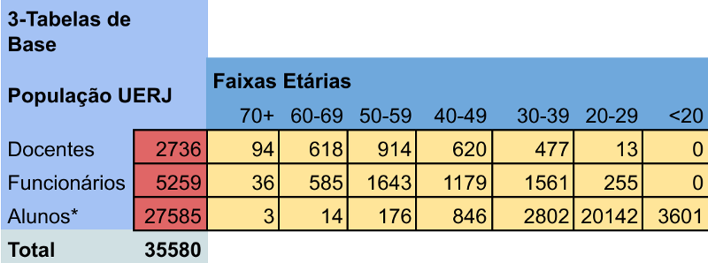
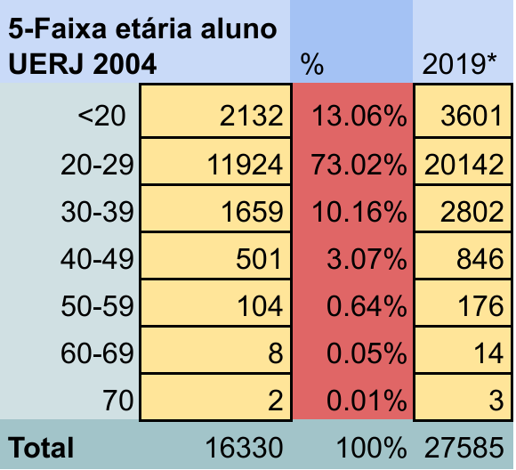
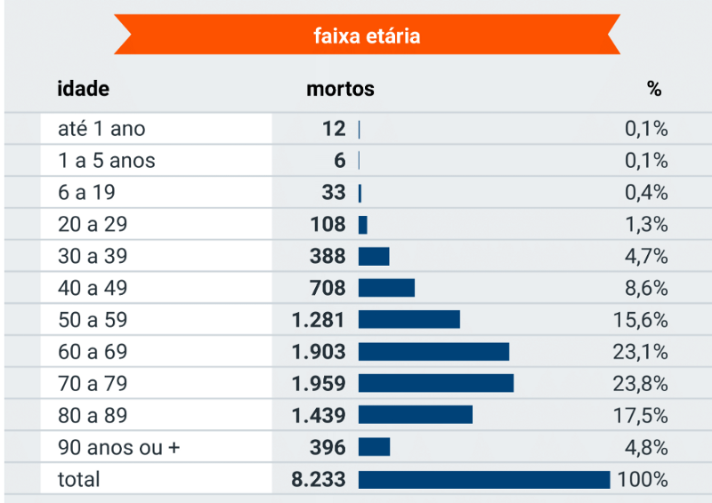
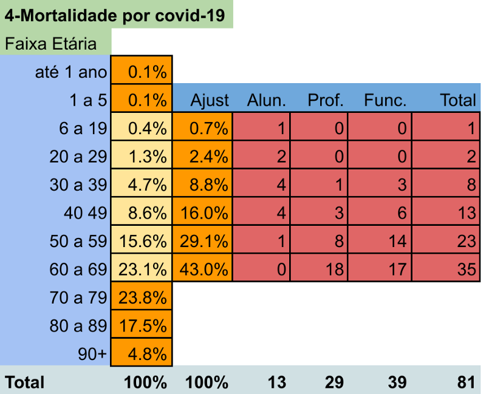

Estamos vivendo uma pandemia sem precedentes no mundo, e ela está sendo especialmente cruel no Rio de Janeiro.

Sou professor da engenharia de computação da UERJ e me vi confrontado aos temores de como seria a volta às aulas, num cenário sem vacinas e sem tratamento para a Covid-19.

Como seria? Quantos arriscariam suas vidas?

Não sou estatístico nem epidemiologista, então **não** tomem este artigo como um artigo acadêmico. É apenas um exercício de imaginação baseado nos dados que disponho. Outras pessoas estão melhor qualificadas para fazer este cálculo, mas como não achei nada semelhante, resolvi eu mesmo fazer este exercício de imaginação. O cenário não é bonito e espero estar enganado.

### A Hipótese

Volta às aulas imediatamente, sem vacina e sem medicamentos que curem a **covid-19**, com o objetivo de alcançar a “_imunidade de rebanho_”, que alguns dizem ser de **70%** de pessoas contaminadas.

#### População da UERJ

Antes temos que ver qual é a população da **UERJ**. Aqui estou levando em conta apenas alunos, professores e funcionários. Isto torna minha avaliação bem otimista, pois a UERJ tem muitos prestadores de serviço e um público flutuante, trabalhando em cantinas e restaurantes, aleḿ copiadoras.

População UERJ. *Faixa etária dos alunos extrapoladas a partir dos dados de 2004.

Esses dados foram obtidos do [Data UERJ de 2019](http://www2.datauerj.uerj.br/pdf/DATAUERJ_2019.pdf). Deste relatório também obtive as faixas etárias de professores e funcionários. Para as faixas etárias dos alunos, foram feitas projeções baseadas nos dados de um relatório relativamente antigo, não encontrei dados recentes. Assim, tive que me basear em um relatório de 2004, o [Anexo 5 — Censo Escolar dos Alunos da Graduação, pág. 7](https://www.uerj.br/wp-content/uploads/2017/10/Anexos2_Diagnosticos_2008.pdf). Mesmo sendo uma projeção, não acredito que o perfil etário dos alunos tenha se modificado tanto a ponto de comprometer a previsão.

Faixa etária dos alunos. *Dados de 2019 extrapolados a partir dos dados de 2004.

#### Letalidade da covid-19

Agora resta saber a letalidade da covid-19. Este é um número complicado de se achar, mas resolvi me basear nos dados de Nova York, pois eles testaram bastante e chegaram à conclusão que a covid-19 atingiu 25% da população, na época destes dados, com 12571 óbitos. Aqui estou pegando o cálculo do Átila Iamarino, no seu vídeo no [youtube](https://youtu.be/gs-HlvC5iJc?t=2507). De base destes dados, ele calculou que a letalidade da covid-19, ou seja, a proporção entre aqueles que foram contaminados e aqueles que morreram foi de 2100000 (25% da população de NY) dividido por 12571 óbitos = 0,6% (0,598%, para ser exato).

Usando a “**imunidade de rebanho**” de _70%_, sobre a população total da UERJ, temos _70% x 35580 = 24906_. Vale notar que essa teoria da imunidade de rebanho não é comprovada. Ela diz que ao atingir essa proporção, a população adquire imunidade à doença. Se eu aplicasse a letalidade da covid-19 (0,6%) em cima deste número, eu obteria **149** **mortos**. Mas a coisa não é tão simples, existem outros fatores.

Um fator forte é a idade. Vamos ver a taxa de mortalidade por faixa etária no Brasil. Os dados aqui foram obtidos do site [poder360](https://www.poder360.com.br/coronavirus/conheca-a-faixa-etaria-dos-mortos-por-covid-19-no-brasil-e-em-mais-5-paises/):

Taxa de Mortalidade Covid-19 Brasil, fonte: [Poder360](https://www.poder360.com.br/coronavirus/conheca-a-faixa-etaria-dos-mortos-por-covid-19-no-brasil-e-em-mais-5-paises/).

#### Perfil etário da UERJ

O perfil etário da UERJ é diferente. A Universidade não tem um público abaixo de 15 anos nem acima de 70 (na realidade alguns professores e funcionários estão acima de 70, porém acredito que numa situação de volta às aulas, eles seriam dispensados). Assim, fiz a tabela seguinte que concentra as porcentagens na faixa que vai entre os 15 e os 69 anos. Dispensando os extremos, a mortalidade geral cai de 0,6% para 0,3%. Mesmo aqui estou sendo otimista, pois não estou levando em conta os profissionais dos hospitais da UERJ, que sabidamente têm uma taxa de contaminação acima da população em geral.

Na tabela a seguir, a coluna “_Ajust._” apresenta os números ajustados desprezando os extremos. Na parte avermelhada, faço o cálculo do número de óbitos de acordo com a faixa etária para cada categoria da população da UERJ.

Taxa de mortalidade por faixa etária no Brasil com dados ajustados para a população da UERJ.

#### Conclusão

Resumindo, uma volta à rotina na UERJ hoje poderia provocar a morte de:

*   **13 alunos,**
*   **29 professores** e
*   **39 funcionários.**

Um total de **81 pessoas**.

Esses cálculos foram baseados numa população da Universidade de 35580 pessoas, uma imunidade de rebanho de 70% e uma letalidade de 0,3%.

Sinceramente, acho esses números excessivamente otimistas. Primeiro porque a UERJ tem uma população flutuante bem expressiva: prestadores de serviço, empregados de cantinas, copiadoras, livraria, etc. E segundo, não levei em conta a taxa de contaminação do pessoal da área médica. Tratei eles como a população em geral, mas sabemos que entre eles a possibilidade de contágio é maior.

Por esses cálculos, uma volta à “_normalidade_”, se é que podemos chamar assim, teria um custo em vidas enorme. 81 famílias sofrendo por mortes que poderiam ser evitadas. 81 pessoas perdidas para sempre.

A planilha que usei para esses cálculos está no [google sheets](https://docs.google.com/spreadsheets/d/1PtQv8nuDUgRaKyesIb5L0fEW8csRot7IH3rqqqIfn8w/edit?usp=sharing).

Se você viu algum erro, faça-me saber. Como disse no início, espero que meus cálculos estejam errados.
