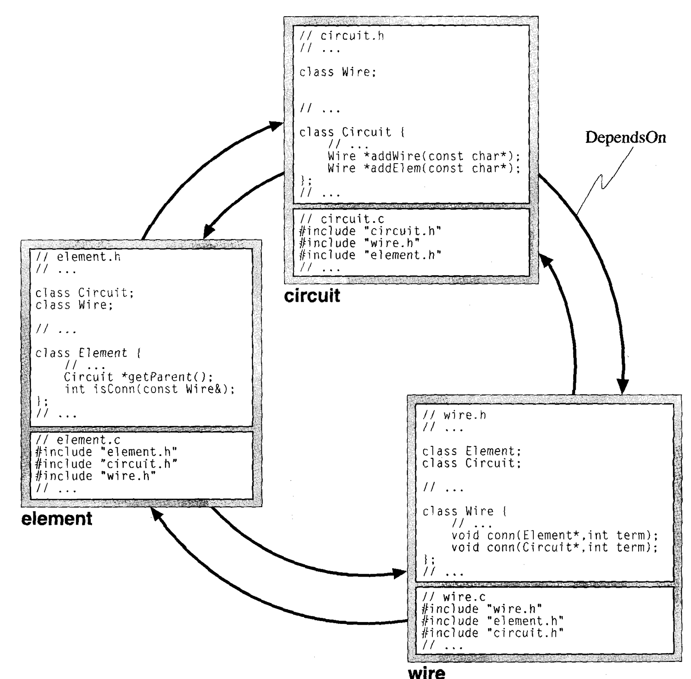
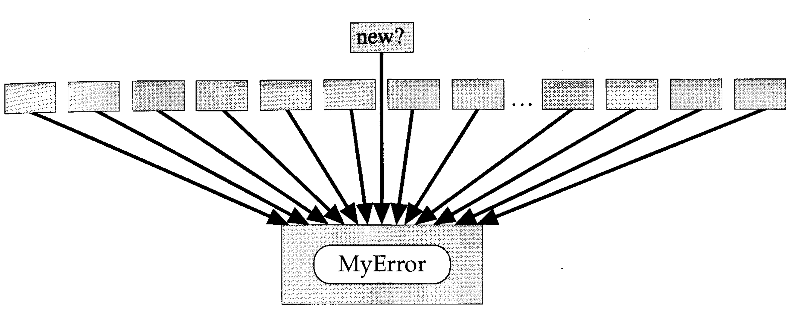

# Problemas Comuns encontrados em Grandes Projetos
## Dependências Cíclicas
Um dependência cíclica ocorre quando uma classe depende de outra que, num círculo vicioso, também depende de outras classes que por suas vez dependem da classe original...

No Exemplo, a Classe *Circuito* inclui as definições das classes *Fio* e *Elemento*, a Classe *Elemento* inclui as definições das classes *Circuito* e *Fio*, que por sua vez inclui as definições de *Elemento* e *Circuito*

## Tempo excessivo para linkar dependências.
Isso ocorre quando tentamos usar elementos pesados em vez de elementos leves, ou seja, elementos pesados são aqueles com um excesso de funcionalidades que o tornam mais pesado, com funções que nem sempre são utilizadas.

Exemplo seria uma classe *String* com inúmeras funcionalidades que tornam gigantesco o executável de um simples programa como "Hello, Wolrd!".

## Tempo excessivo para compilação de dependências
C++ normalmente utiliza mais arquivos que um programa em C. Um acoplamento excessivo entre esses arquivos torna o tempo de compilação muito maior do que seria necessário.

Por exemplo, o componente **meuerro** define uma *struct* *MeuErro* que contém a enumeração de todos os possíveis códigos de erro. deste modo, quando um novo componente é criado, pode ser necessário criar um novo código, só que isto levaria à compilação de todos os componentes que utilizam **meuerro**. Se o número de componentes cresce, acabamos abandonando a ideia de um novo código de erro para aproveitar apenas códigos genéricos, como "ERRO" ou "ALERTA". Neste ponto, o designjhe se tornar praticamente inútil.

## Espaço de nomes global
A proliferação de nomes globais pode ser problemática. Obviamente esses nomes podem colidir, mas pode ser ainda mais grave.

Por exemplo, uma definicão do tipo:

    TargetId id;

Isso pode levar a dúvidas sobre onde teria sido declarado este tipo e quais são suas caracterísiticas. É uma classe? É uma *struct*? 

Uma definição do tipo:
    // upd_system.h
    #ifndef INCLUDE_UPD_SYSTEM
    #define INCLUDE_UPD_SYSTEM

    typedef int TargetId;
    class upd_System {
      // ..
    public:
      // ..
    }

seria uma má ideia. No caso, a declaração ficaria sem ambiguidade se fosse acrescentado seu *namespace*
    // upd_system.h
    #ifndef INCLUDE_UPD_SYSTEM
    #define INCLUDE_UPD_SYSTEM

    class upd_System {
      // ..
    public:
      typedef int TargetId;
      // ..
    }

Assim, *TargegId* poderia ser usado com:
    upd_System::TargetId id;

E seria facilmente visto onde esta definição foi declarada.

