O título é polêmico e provocativo, eu sei, meu objetivo aqui é mais pensar na orientação a objetos, resumindo os argumentos do vídeo de Brian Will, cujo título em inglês é "_Object-Oriented Programming is Bad_" e nesse processo fazer minhas próprias reflexões sobre este importante paradigma de programação.

## Pequeno histórico                 

Quando comecei a programar, nos anos 1980, usávamos apenas programação procedural. Um comando, uma ação. É o tipo de programação que temos em linguagens como C, Fortran e Pascal. Este tipo de programação, se feita sem disciplina, pode levar ao famoso "_código espaguete_". O que é isso? É um código emaranhado, no qual você se perde facilmente e cheio de efeitos colaterais.

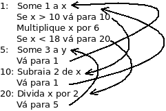

A solução para este problema foi a programação estruturada. Neste tipo de programação cada bloco lógico só podia ter uma entrada e uma saída.
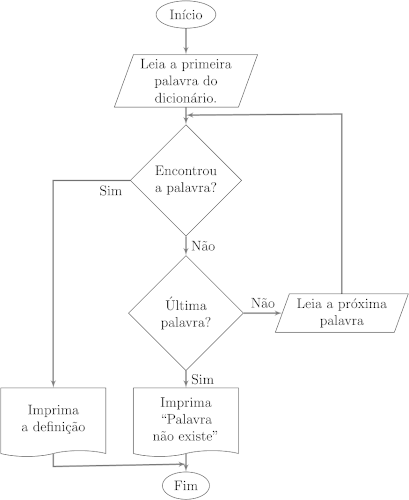

Foram surgindo novos paradigmas de programação e um de maior sucesso é a **Programação Orientada a Objetos**. Quando descobri este paradigma tudo ainda era muita novidade. Poucas linguagens de programação o suportavam. O exemplo era a linguagem Smalltalk que apresentava esses princípios. Na época eu estava fazendo minha tese de mestrado e lembro de ler um livro que preconizava que "_no futuro cada fabricante de software vai dizer que segue, cada programador vai alardear sua proficiência no paradigma, mas cada um vai seguir a orientação a objetos da sua própria maneira, e nenhuma delas será correta_".

O que é chamado de futuro tem o péssimo mau gosto de um dia chegar e se tornar presente. Algumas previsões se tornam realidade e este livro se mostrou bem previdente. Hoje cada linguagem de programação utiliza a POO de seu jeito e cada programador a interpreta de acordo com suas crenças. Não acho que seja de todo mal, porque ao longo do tempo a POO se tornou o próprio emaranhado de código que ela pretendia evitar. Em vez do "código espaguete", surgiu o "código lasanha", para ficar nas analogias de massas italianas. Às vezes a programação orientada a objetos vira mesmo uma mistura de lasanha com espaguete.

## Questionamentos
Até que ponto eu acho que devemos aplicar os conceitos da orientação a objetos? Quando ela torna o código pior de ser lido ou ineficiente sem acrescentar segurança e facilidade de manutenção? Quando se torna um entrave à programação de qualidade? Seguir os conceitos da POO a ferro e fogo acrescenta qualidade ao programa? Ou o conjunto de regras se tornou apenas uma muleta para maus programadores, que justificam o código ruim apenas porque seguem os parâmetros da POO?

Um exemplo de mau uso da POO é o uso de _getters_ e _setters_. Um dos princípios básicos da POO é o **encapsulamento**. Um objeto deveria ser definido pelo seu comportamento enquanto a estrutura interna ficaria "_escondida_" do usuário. Mas o que vejo muitas vezes sendo implementado? O programador cria uma classe, coloca atributos privados e depois cria um _get()_ e um _set()_ para cada um deles. O que um atributo com _get_ e _set_ se diferencia de uma variável global? O que se ganhou com a POO nesse caso a não ser mais complexidade do código enquanto de fato existe uma variável global, como todos seus defeitos? Mesmo quando alguns parâmetros permanecem privados, o estado do objeto é revelado por alguma forma de _get_ ou _set_. O programador segue seguro de que está fazendo a coisa certa, afinal variáveis globais são fontes de dor de cabeça, mas seu objeto, encapsulado toscamente, se comporta como uma variável global.

Há muito tempo eu me questionava sobre a POO e confesso que nunca gostei de usar todos os seus conceitos, por achar que eles complicavam mais do que ajudavam o desenvolvimento de código.

## O Vídeo

Bom, Brian Will fez, na minha opinião, um ótimo vídeo sobre esse assunto. Título polêmico, mas que faz pensar. Muito do que ele fala eu concordo, às vezes concordo apenas em parte. Então resolvi escrever sobre ele aqui.
Que vídeo é esse? Deixo com você o vídeo original e depois meu resumo.


## Meu Resumo

Ele começa dizendo que a POO não resolve os problemas que ela diz resolver. _Isto é uma parte da verdade. Não existe "bala de prata" para a programação. Muitas vezes fazer um programa simples, direto, sem classes e objetos, a boa e velha programação estruturada, é o que se precisa para resolver um problema e a POO só adiciona complexidade desnecessária._

O vídeo é dividido em 4 partes:
1. Sobre o que ele não está reclamando
2. O que é realmente POO
3. Porque a POO dominou a indústria
4. Como deveríamos escrever programas sem POO.

Aqui vai uma quase transcrição dele, com alguns poucos comentários, quando eu achar necessário. No final volto com minha conclusão.

## Sobre o que ele não está reclamando
O que não é problema na POO:

### Classes
As classes em si não são um problema. É possível, ocasionalmente, programar com classes e isso pode ser benéfico. _O problema seria o exagero, quando se tenta implementar cada aspecto do comportamento de um programa por meio de uma associação de dados com funções. Muitas das vezes isso é feito de forma artificial, apenas para encaixar nosso problema no paradigma da POO._

### Desempenho
Desempenho também não é um problema de POO, e neste ponto ele recomenda assistir o vídeo de [Mike Acton: Data-Oriented Design and C++](https://youtu.be/rX0ItVEVjHc).
_Concordo com ele. Linguagens como C++ usam classes  e POO e no entanto entregam código muito eficiente, apesar que C++ não implementa a POO de maneira absoluta. A perda do desempenho dos programas em Java vem muito mais do uso de máquinas virtuais que do uso da POO em si._

### Abstrações
Muitas abstrações podem ser boas. _Programar é lidar com abstrações. Temos que modelar o mundo real com código para um computador. Não há como fazer isso sem criar abstrações. No entanto, a forma com que criamos abstrações na POO pode ser um problema._

### Estética
Outro bom vídeo sobre o assunto é o de [Abner Coimbre: What Programming is Never About](https://youtu.be/Lzc3HcIgXis). Abner diz que programar não diz respeito à estética dos programas, mas sobre o que realmente o código faz. Neste ponto ele discorda, _e eu também, porque de alguma maneira a estética tem seu valor na programação. Quem gosta de programar sente real prazer em ler um programa bem escrito_.

Mas aqui temos que especificar o que é a **estética de um programa**.

Alguns aspectos fazem um programa ter uma bela estética e isso é importante buscar ao se programar. Quais são esses aspectos?

 * Elegância,
 * simplicidade,
 * flexibilidade,
 * facilidade de leitura e manutenção e
 * uma boa estrutura

 Segundo Brianm, todos esses aspectos melhoram a estética de um programa. Porém a POO não entrega isso, mas uma ilusão desses aspectos, fazendo com que a elegância e a simplicidade sejam realmente piores.

Brian também destaca que ele advoga a programação procedural, não necessariamente a _programação funcional_, que são coisas diferentes. De fato, ele acha que a programação funcional é o futuro da programação de alto nível e que em dez anos talvez ela seja o modo prevalente com o qual as pessoas estarão programando, porém essa programação tem problemas de eficiência, que tornam a programação funcional inviável em muitos domínios.

## Paradigmas de programação abordados

### Programação procedural & imperativa
Sendo a **programação procedural** aquela na qual não há associação explícita entre seus tipos de dados e suas funções e seus comportamentos; e  a **programação imperativa** aquela na qual podemos modificar estados quando desejamos, não existindo nenhum método especial ou estado compartilhado.

_Neste ponto gostaria de destacar, para fins didáticos, que quase toda programação procedural é também imperativa, mas nem toda programação imperativa é procedural. A POO também é uma programação imperativa._

Esta era a forma de se programar no início da computação. As variáveis existem e são modificadas e resolvemos os problemas a medida que eles aparecem. Conforme os programas foram ficando maiores, as pessoas começaram a pensar em como domar a complexidade crescente dos estados compartilhados.

Foram usadas duas formas de lidar com isso. Veremos a seguir.

### Programação Procedural & Funcional

Uma delas diz que o código deve ser **Procedural & funcional**, na qual uma boa parte das funções sejam puras, isto é, sem lidar com estados. Neste caso, o problema de estados compartilhados é abordado com a sua minimização.

### Programação orientada a objetos e imperativa
A outra solução foi fazer um código **orientado a objetos e imperativo**. Neste caso simplesmente segregamos o estado. Pegamos o estado que constitui nosso programa e em vez de compartilhá-lo de forma promíscua, tentamos a abordagem de dividir e conquistar, no qual pegamos nossos estados e os encapsulamos em unidades que chamamos **objetos**. Estes objetos, por sua vez, podem conter outros objetos e assim por diante.

### Programação Orientada a Objetos & Funcional
As duas soluções anteriores são na realidade ortogonais entre si, o que leva a uma **programação orientada a objetos & funcional**, que combina as duas técnicas em uma terceira, segregando os estados e minimizando sua interação.

## Características da POO

Brian destaca que na sua definição de POO não falará nada sobre **herança**, pois considera este aspecto irrelevante, pois ninguém defende o uso da herança nos dias atuais. Mesmo quem advoga a POO diz que a herança deve ser utilizada com extremo cuidado ou mesmo não utilizá-la de jeito nenhum. Assim sendo, herança não é um argumento relevante sobre se POO é boa ou má.

Por razões similares, ele não fala nada sobre **polimorfismo**, posto que mesmo programação não orientada a objetos pode ser polimórfica de maneira ainda mais forte que em algumas linguagens voltadas para a POO.

Finalmente ele fala sobre a principal razão pela qual ele advoga que POO é ruim: **encapsulamento**. Para ele o encapsulamento não funciona em níveis muito refinados nos quais a POO a prescreve. Assim, ela prescreve que deveríamos dividir os estados em níveis cada vez menores. Para ele, isso não funciona na POO e leva à codificação sem sentido.

Mais adiante será explicado porque o encapsulamento é ruim na POO, por enquanto Brian prefere especular sobre o porquê a POO dominou a indústria de software.

## Por que a POO dominou a indústria?
Alguns acham que a POO foi uma imposição da gerência, que teria ficado fascinada pelas promessas da POO de reusabilidade e compartimentação. Para Brian, apesar de parecer plausível, a POO não entrega o que promete e não lhe parece que gerentes estariam envolvidos nesse tipo de decisão técnica. Para ele a POO foi algo imposto pelos próprios programadores, mas por que?

Para ele uma boa parte da resposta está em **Java**. Quando surgiu no meio dos anos 1990, Java parecia ser um alívio bem-vindo para programadores quando comparada com seus concorrentes. Em relação às alternativas, Java parecia ser bem simples. Ele fornece um exemplo de programação para o S.O.na época, usando a api32 do Windows.

 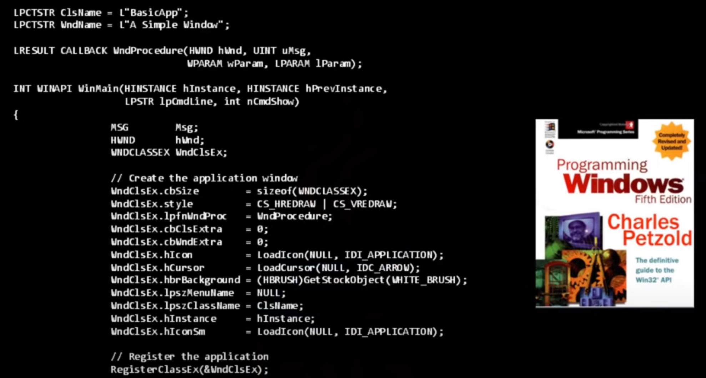

 O programador tinha que lidar com a gerência de memória, e a programação com a **api32 do Windows**, usando macros, estava bem distante do que se havia aprendido do famoso livro **K&R** de **C**. Com a mudança nesta mesma época de Windows 16 para 32, os programadores C estava desesperados para encontrar uma solução para seus problemas. A única alternativa na época era o Visual Basic, que também era uma plataforma da Microsoft, ou então usar Pascal ou Delphi, que também tinham seus problemas.

 Foi uma grata surpresa quando a **Sun Systems** apareceu dizendo: vejam esta linguagem, ela é gratuita e pode ser usada em diversas plataformas.

 ## Java
 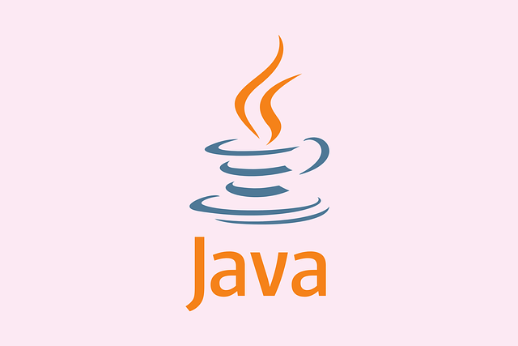

 Java parecia ser simples e realmente sua convenção de nomes era bem mais simples que as APIs medonhas existentes. Por exemplo: na API de Java vemos coisas como **FileInputStream**, que é algo bem mais amigável que o "**ioctl**" do Unix ou o medonho "**LPCTSTR**" da API do Windows. Java vinha dizer que a programação não precisava ser críptica, sem essas abreviações horríveis.

 Java também adotava a sintaxe de C sempre que possível, fazendo-a parecer mais familiar aos programadores C e C++. Além disso, seu uso de _bytecodes_ livrava os programadores das dores de cabeça relativas às plataformas diferentes dos sistemas operacionais. Uma das grandes contribuições de Java foi o uso de _namespaces_ que permitiam a programação sem a necessidade de arquivos de cabeçalho (arquivos .h).

 Enquanto programadores C e C++ tinham que lidar com a gerência de memória e ponteiros, Java dava a solução muito sedutora da coleta de lixo (**garbage collection**), evitando muitos erros de memória. Outro aspecto sedutor é a gerência de exceções. Programadores C e C++ têm que gerenciar eles mesmos suas exceções com algum tipo de código de retorno de erro ou algo similar, o que não é nenhum pouco bonito.

 Algumas pessoas também foram seduzidas pelo formato _sujeito.verbo(objeto)_ das chamadas de métodos, pois se assemelha com a linguagem falada.

 Esse formato levou à criação de **IDE**s que permitiam um simples rolar de opções numa tela para descobrir a sintaxe exata que queremos usar, facilitando a programação mesmo para quem não conhece muito bem a linguagem. Apesar desta facilidade poder ser implementada em linguagens procedurais, por razões históricas isso apareceu primeiro em Java.

  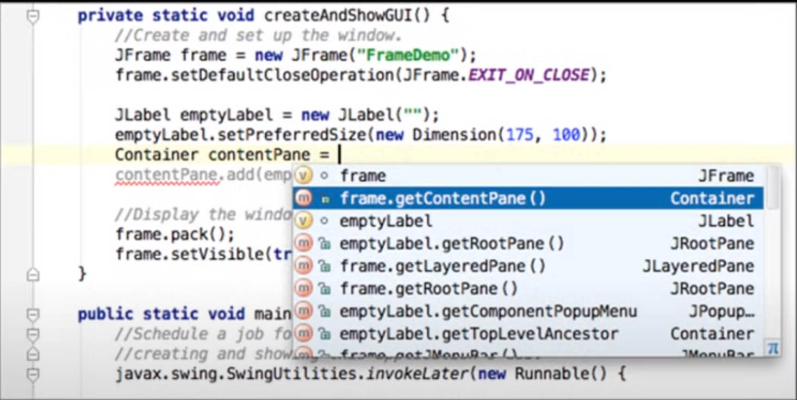

 Nos anos 1990 também se popularizou o uso de interfaces gráficas, e pareceu lógico associar elementos da interface gráfica com classes da POO. Era uma correspondência _natural_.

 Com Java se podia finalmente fazer desenvolvimento rápido de aplicações (RAD) com interfaces gráficas da mesma forma que se fazia em Visual Basic, exceto que em Java estávamos livres da plataforma da Microsoft.

 Porém, todas as razões do sucesso de Java poderiam ter ocorrido com o mesmo sucesso em alguma linguagem não orientada a objetos. Portabilidade, coleta de lixo, gerenciamento de exceções, tudo isso poderia ser feito sem o uso de objetos, ou, visto de outra forma, sem a necessidade de obrigar o uso de classes de Java. _A linguagem Python, hoje em dia faz isso. Em Python você pode usar todos esses recursos e programar sem classes ou fazer uma mistura de paradigmas, sem problema_.

 ## Busca de Soluções para a Complexidade do Código

 Se voltarmos aos anos 1960 ou 1970, as pessoas estavam envolvidas com programas cada vez maiores, e procuravam uma maneira de encontrar unidades abstratas de código que fossem maiores que funções e tipos de dados. Era lógico descrever grandes sistemas em termos de seus componentes.

 Por exemplo, quando queremos descrever o corpo humano, em vez de uma descrição microbiológica, usamos grandes órgãos, como cérebro, rins, estômago e assim por diante. Deste modo, a abstração maior que uma função e um tipo de dados é uma combinação dos dois e assim os objetos nasceram. Pegamos funções e tipos e os combinamos em unidades maiores.

 ## Ideologias da Programação

 Este tipo de pensamento levou aos conceitos de padrões de programação (**patterns**) e aos chamados princípios **SOLID** (**S**ingle Responsiblity, **O**pen-Closed, **L**iskov Substitution, **I**nterface Segregation, **D**ependency Inversion), **injeção de dependência**, **Agile**, e **test-driven-development**. Todos esses conceitos foram empilhados por pessoas que passaram a dizer que este era a maneira correta de fazer POO.

 Para Brian, no entanto todas essas práticas representam apenas remendos e são compensações para o fato que a visão original de POO nunca cumpriu seus compromissos. De tempos em tempos surge uma nova ideologia de como deve ser feita a POO, e a cada vez é a forma definitiva de fazê-la corretamente.

 Para ele, todas essas "ideologias" são apenas acréscimos com muitas falas místicas nascidas a partir de percepções genuínas, porém não são coesas. A orientação a objetos seriam assim o círculo que estamos tentando fazer quadrado por mais de uma geração.
 

 ## Por que a POO não funciona?
 O que tem realmente de errado na POO, especialmente no encapsulamento?

 Considere primeiro o que é um objeto. Um objeto é um pacote de um estado encapsulado e não interagimos diretamente com esse estado. Toda interação com este estado vem do mundo exterior por meio de mensagens. Assim, um objeto é definido pelo conjunto de mensagens que ele pode receber e chamamos isso de _Interface Pública_. Temos uma informação privada isolada do mundo externo por uma interface pública.

  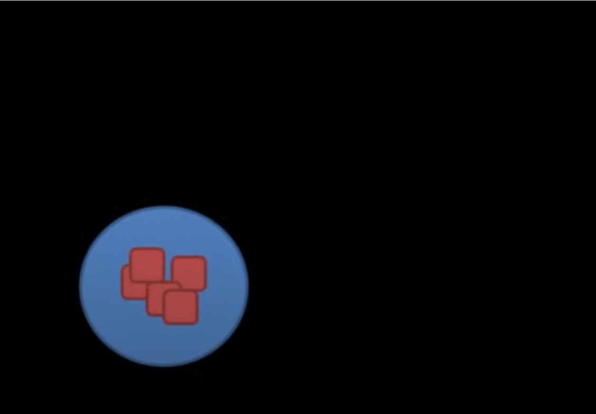

 Quando um objeto recebe uma mensagem, ele pode, por sua vez, enviar outra mensagem para outro objeto e assim por diante.
 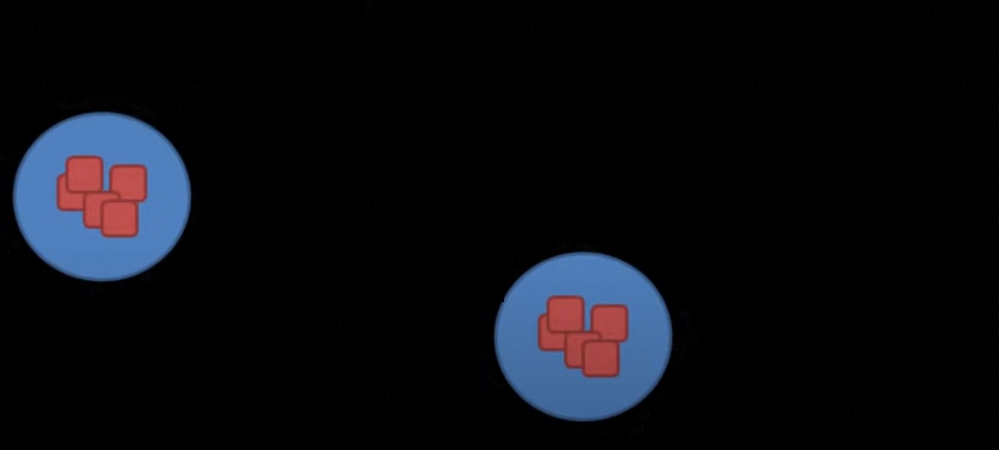

 Desta forma, podemos conceber a POO como uma grafo de objetos se comunicando com outros objetos pelo envio de mensagens.
 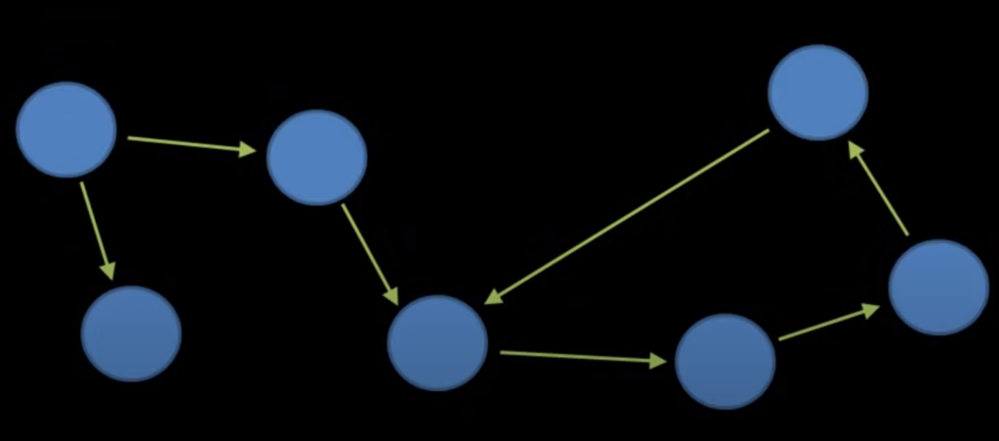

 Muita gente esquece hoje em dia que uma mensagem não é somente um sinônimo para uma chamada de método, apesar de que na prática realmente signifique a chamada de um método. No seu conceito original uma mensagem, estritamente falando, significa o envio de cópias de estados, ela não envia referências. Uma mensagem envia e recebe informações sobre os estados, não o próprio estado,

 Deste modo, mensagens não podem passar referências. Apesar desta característica,  os códigos escritos em Java ou C# não seguem esta regra. Talvez Smalltalk a siga, mas os programas não usam, por uma boa razão que será discutida à frente.

 Para um objeto **A** enviar uma mensagem para o objeto **B**, o objeto **A** deve guardar uma referência privada do objeto **B**, senão como ele se comunicaria com **B**? Como mensagens não podem levar referências, a única maneira do objeto **A** conhecer **B** é esta referência estar com ele desde sua concepção.

 Uma consequência ainda mais profunda é que se o objeto A consegue enviar mensagens para o objeto B, B deve ser parte do estado privado de A, e pelo princípio do encapsulamento, um objeto deve ser responsável por todos os objetos para os quais ele envia mensagens.

 Podemos então considerar que mensagens leem e modificam estados. Quando B envia mensagem para A, ele está alterando o estado de A. O que acontece quando outros objetos enviam mensagens para A? Temos, desta forma, um estado compartilhado. Não é muito diferente de ter uma simples variável global.
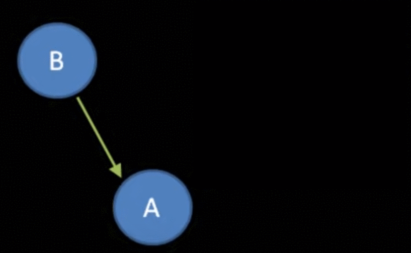


 Se dez objetos podem enviar mensagens para um outro objeto, eles estão implicitamente compartilhando um estado. Podemos dizer que a interação ocorre por meio de uma interface pública, porém estes métodos estão fornecendo um tipo trivial de coordenação de um estado. Você pode definir regras, dizendo, por exemplo, "se você quer ter acesso a este campo, pode apenas incrementá-lo. Você não pode mudá-lo de nenhuma outra forma." Ótimo, mas isto é um tipo de proteção muito trivial.

 A questão aqui é mais profunda. Se dez objetos compartilham o estado de um objeto, onde está a coordenação verdadeira? E a resposta é que ela não existe.

 **No momento que os estados dos objetos são compartilhados, o encapsulamento desaparece.**

 A única forma de garantir o encapsulamento é por meio de um grafo, mas não qualquer tipo, mas um com uma hierarquia rígida. No topo da hierarquia temos o objeto representando o programa inteiro. É o nosso objeto "Deus". Esse objeto tem filhos que representam os subcomponentes e estes por sua vez têm outros subcomponentes. E cada objeto na hierarquia é responsável por seus filhos diretos. As mensagens passam somente do pai para seus filhos diretos. Um objeto-pai não pode enviar mensagens para o objeto-neto, por exemplo.
 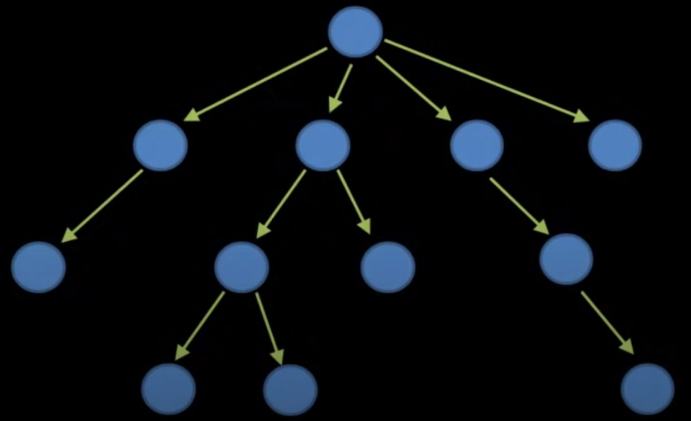

 Um objeto não pode enviar mensagem para outro sem passar pela hierarquia. Para o objeto A se comunicar com o objeto B, isto deve passar pelo topo do hierarquia. De alguma maneira A deve modificar seu estado, até chegar ao ancestral comum.
 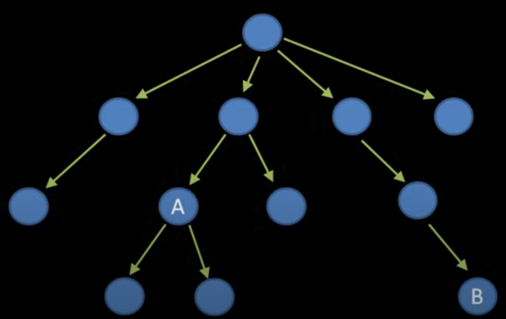

 Obviamente ninguém escreve programas assim, porque é uma maneira absurda de escrever programas.

 Um argumento é que as pessoas podem aplicar o conceito do encapsulamento de maneira inconsistente e mesmo assim acrescentar valor aos programas que usem o conceito de forma parcial.

 Imaginem que temos um programa cujo grafo de comunicação entre objetos seja o seguinte:
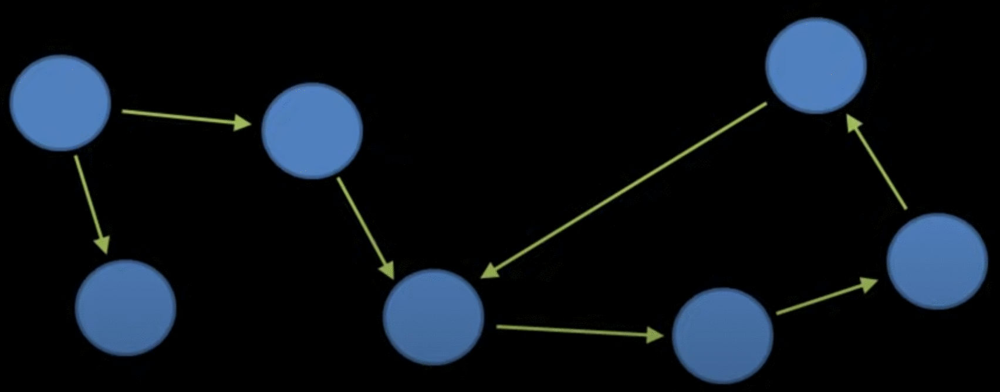

Após uma análise, chegamos à conclusão que existe um sub-sistema de objetos que determina uma hierarquia e decidimos refatorar o código. No exemplo abaixo, após uma análise identificamos relações entre os objetos A, B e C:
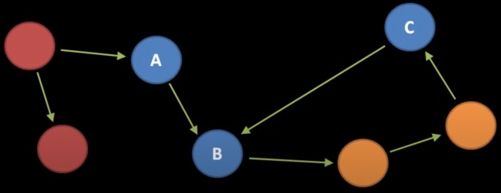

Em vez de seguir o caminho de repensar toda a estrutura do código, o que poderia ser bem complicado, o mais comum é introduzir novos objetos que explicitem esta nova hierarquia. No caso aqui o objeto D se torna o objeto "Deus" dessa hierarquia.
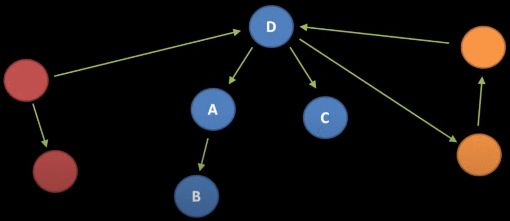
Se tivermos sucesso em fazer este refatoramento, o código atende parcialmente o conceito mais estrito de encapsulamento, na nova hierarquia criada.

Mas se descobrirmos que temos que fazer nova comunicação que viole esta hierarquia? No caso aqui, uma comunicação do objeto C com os objetos E e F. A tentação é grande para fazê-la diretamente, e consequentemente violar mais uma vez a hierarquia dos objetos e o encapsulamento dos estados.
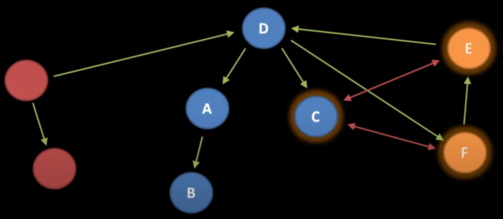
Outra solução seria criar uma nova hierarquia de objetos para abarcar esta nova comunicação, mas isso poderia ser bem complexo, criando um novo objeto "Deus" G.
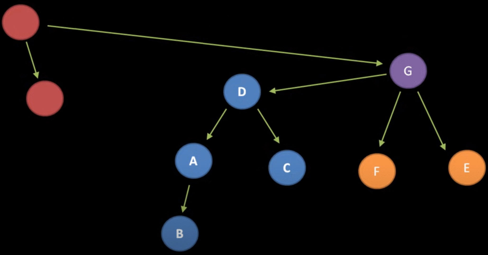

Brian chega à conclusão que tanto a maneira parcial quanto a maneira correta de fazer a POO são ruins. Vamos seguir a POO de maneira correta e criar esta gigante pilha de objetos, ou seremos mais lenientes e usaremos a POO de maneira parcial? _Conseguimos, na melhor das hipóteses, apenas uma ilusão de encapsulamento_.

Para Brian, usar esta forma incompleta de projetar software OO é como construir uma casa sem saber ao certo como os cômodos se comunicarão. Depois das paredes levantadas, temos que quebrar as paredes para conseguir que a casa seja útil. Mesmo que tenhamos a planta original definida, uma vez que os requerimentos originais do software mudem, estaremos em maus lençóis.
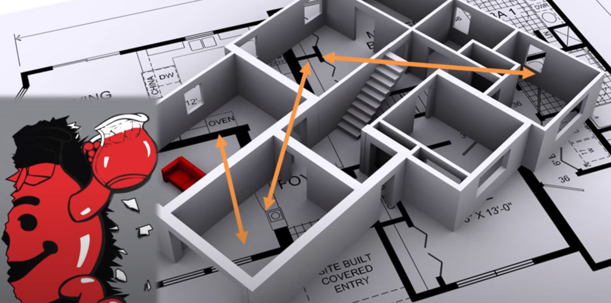

Assim, devemos ser muito criteriosos antes de erguer barreiras e impor uma estrutura. A ausência de estrutura é melhor que um estrutura ruim, porque as pessoas olham para aquilo procurando algo e encontram outra coisa completamente diferente.

No mundo da POO temos que raciocinar em termos de todos estes grafos: a hierarquia da herança, o grafo de composição e o fluxo de dados entre objetos e também sobre o grafo do código.

Na programação procedural temos que pensar apenas no grafo de chamadas. Temos também, é claro que pensar na estrutura de dados e como ela é modificada pela execução do programa, mas a beleza disso é que podemos pensar nisso totalmente livres da noção de responsabilidades. Quando olhamos para os dados, pensamos apenas nos dados, e quando pensamos nas funções podemos pensar livres de todas essas barreiras. Não estamos o tempo todo tentando agrupar coisas em unidades chamadas de "responsabilidades singulares" (_single responsabilities_).

## Jogo mental da POO

Quando usamos a POO temos jogar este jogo. Partimos de uma lista mental de tipos de dados do programa, e outra lista de comportamentos que quero que meu programa implemente. De acordo com a POO, temos que associar os comportamentos ao tipos de dados. Teremos então por vezes que criar novos tipos de dados (E e F, na figura abaixo) apenas para acomodar comportamentos que não se encaixam nos tipos existentes.
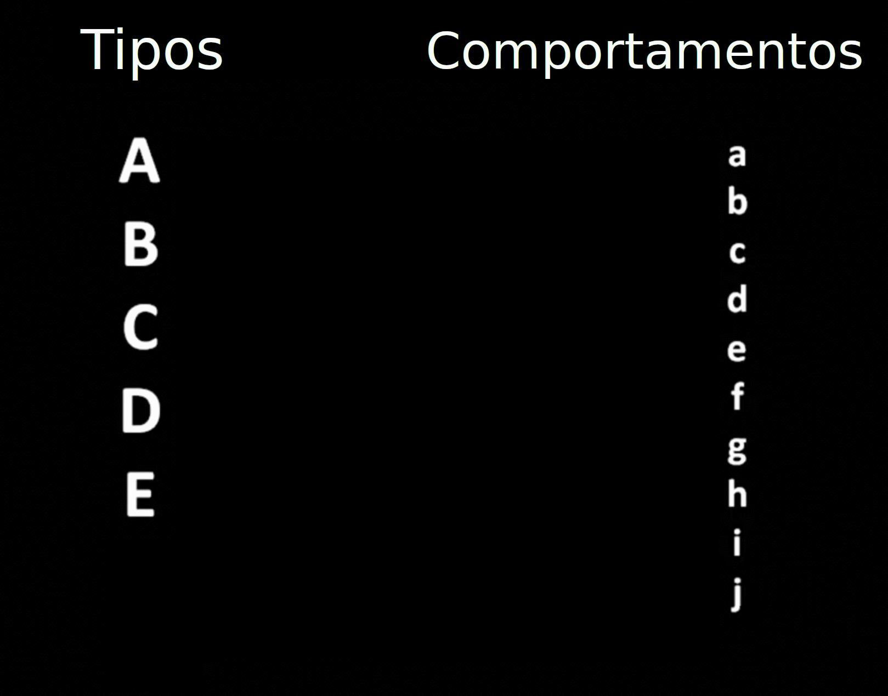

Conforme o programa OO se torna maior, essas formas não naturais de tipos de dados surgem, apesar de não terem função dentro da concepção natural dos dados necessários para o programa. Eles existem apenas como texto, dentro da ideologia de modularização do código.

Acabamos caindo no que [Steve Yegge](http://steve-yegge.blogspot.com/2006/03/execution-in-kingdom-of-nouns.html) chama de **Reino dos Nomes**, no qual cada aspecto dos programas não é mais concebido como verbos e nomes, mas como nomes, coisas que representam um conjunto de comportamentos. Assim, o código orientado a objetos é baseado em classes de serviços (_services classes_) e classes de gerência (_manager classes_) e todo tipo de classe nebulosa e abstrata.

Na POO nos vemos fazendo perguntas estúpidas como: um objeto **Mensagem** deve ter um método _send()_ para se auto enviar? Ou um objeto **Transmissor** deve ter um método _send()_ para enviar um objeto **Mensagem**? Ou devemos ter um objeto **Receptor** com um método _receive()_ para receber objetos **Mensagem**? Ou então seria necessário um objeto **Conexão** com um método _transmit()_ para enviar objetos **Mensagem**?

Rapidamente o mundo real de modelagem que a POO promete se torna um jogo de tolos. O programador perde tempo pensando em termos conceituas da POO em vez de pensar no próprio programa, apenas para encaixar seu programa na análise orientada a objetos.

## Mundo Real da POO
O estudantes tomam contato com a  POO com exemplos triviais de modelagem de uma taxonomia do mundo real:

```java
class Gato extends Animal {
  ...
}
```
Porém o mundo real da análise e projeto de software se mostra muito mais complexo para serem usadas analogias tão simples. O objetivo da abstração na programação é simplificar a complexidade. Assim, temos dificuldade em abstrair os problemas em módulos auto-contidos que não possuem nenhuma analogia com o mundo real.

```java
class ManagerFactory extends Factory {
  ...
}
```

Quando poluímos nosso código com _managers_, _factories_ e _services_ não estamos fazendo nada fácil de ser entendido. Na tentativa de encaixar nosso problema nos módulos da filosofia orientada a objetos, estamos simplesmente fazendo nosso programa mais difícil de entender.

Normalmente, quando analisando código orientado a objetos, um comportamento X não está na classe X, porém distribuído em outras classes, sem correspondência com a interface apresentada ao usuário.

POO tem a característica de quebrar a funcionalidade em diversos métodos entre diferentes classes, tipicamente em diversos arquivos. Isto é aceito em nome de uma noção de classes e de uma assim chamada responsabilidade singular.

Embora a divisão em funções menores realmente seja razoável, a questão aqui é se na POO em vez de reduzir a complexidade não estamos apenas deslocando a complexidade.

## Como escrever programas
### 1. Código procedural
A solução seria escrever código procedural, mas isto não significa abandonar totalmente classes. Linguagens como Python e C++ permitem escrever programas procedurais, enquanto usam a orientação a objetos.

Algumas estruturas possuem realmente uma ligação forte entre métodos e tipos de dados, na criação de tipos abstratos de dados, como listas e filas. Assim, deveríamos escrever métodos apenas quando a associação exclusiva com tipos de dados não deixa margem a dúvidas. Quando começamos a nos interrogar se uma função  em particular realmente tem uma ligação primária com um tipo de dados, este deveria ser o momento no qual você abandona a POO e escreve uma simples função.

Deste modo, primeiro organizamos nosso código como funções e não tentamos encapsular os estados com grande refinamento porque isto simplesmente não funciona.

### 2. Cuidado com estados compartilhados
De qualquer maneira, estados compartilhados ainda são um problema. Não podemos evitá-los complemente, a não ser que utilizemos programação funcional, mas podemos amenizá-lo. Como?
1. Quando em dúvida, parametrize.  
  Em vez de passar variáveis globais para uma função, devemos passá-la como um parâmetro.

2. Empacote estados globais logicamente em tipos de dados como structs/records/classes.    
 Mesmo que isso signifique que você possui apenas uma instância desses estados em todo programa, este pequeno truque fará seu programa parecer mais organizado. Desta forma você está usando os tipos de dados para criar pequenos espaços de nomes (_namespaces_). Se você fizer isto cuidadosamente, um efeito secundário é que você pode passar estados globais de uma maneira mais conveniente para suas funções. Tipicamente, ao empacotar seus estados você reduz o número de parâmetros que precisa passar para as funções, porém fique atento porque não existe uma forma mágica de agrupar entidades

3. Dê preferência a funções puras.  
  Mesmo que você não esteja programando no estilo ou usando uma linguagem funcional, é bom aproveitar uma oportunidade de usar uma função pura pois elas são as únicas que são unidades de código autocontidas. Quando trabalhamos com funções puras, temos que nos preocupar unicamente com a própria função. Veja mais sobre [funções puras na Wikipedia](https://en.wikipedia.org/wiki/Pure_function).

4. Encapsule (levemente) no nível de namespaces/packages/modules.

5. Não tenha medo de funções longas.  
  Geralmente os alunos são ensinados e evitarem longas funções. Em vez disso, elas devem ser divididas em pequenos trechos de código. Isso leva a código como seguinte:
  ```javascript
  function minhaFuncao() {
    fazIsso();
    fazMaisIsso();
    depoisAquilo();
    entãoAquiloOutro();
  }
  ```
  O problema com esse comportamento é o que seria uma sequência lógica de ações, agora está espalhado fora de ordem sobre todo seu código de base.

  É claro que trechos de código que podem ser extraídos e serão utilizados em mais de um lugar no código podem virar uma função. Porém, no caso de uma função que é usada apenas uma vez, é melhor usar comentários no início de cada unidade lógica, mantendo a sequência de comandos.

  _Existe um argumento para evitar funções muito longas, que é ela caber numa tela de computador completamente, facilitando a sua visualização completa. Eu mesmo sempre preferi fazer isso, mas o argumento de Brian me convenceu de que é possível usar funções longas e mesmo assim manter a legibilidade, com o uso de comentário e blocos de código, como ele explica a seguir._

  ```javascript
  function minhaFuncao() {
    // faz isso
    ...
    // faz mais isso()
    ...
    // depois aquilo()
    ...
    // então aquilo outro()
    ...
  }
  ```
  Isto também evita a necessidade de nomear funções.

  Se mesmo assim não for prático manter o código e sendo necessário extrair uma função, isso deveria ser feito por uma função privada, encaixada com a função principal. Isso deixa claro que esta função faz parte da função em que ela está declarada.  
  ```javascript
    function minhaFuncao() {
      function fazIsso() {...}
      function fazMaisIsso() {...}

      fazIsso();
      // faça mais coisas
      ...
      façaMaisIsso();
      // então faz isso
      ...
    }
  ```


  Finalmente, não esqueça de manter as linhas de suas funções dentro de uma margem razoável, sem ir muito longe à direita da tela. Não indente código em muitos níveis.

  Também examine partes do código nas quais a lógica se torna muito complexa e tente eliminar a complexidade. Se não for possível, extraia o código numa função que servirá para isolar esta complexidade.

  Conforme a função fica maior, podem aparecer cada vez mais variáveis. Neste caso restrinja a localidade dessas variáveis, de maneira que ela só exista nos locais necessários e não por toda a função. Uma forma de fazer isso, em algumas linguagens é usando chaves, introduzindo um novo sub escopo:

  ```javascript
      {
        int x;
        ...
      }
  ```

  Neste caso, quando em dúvida nas divisões do código, podemos colocar chaves no que seriam as funções extraídas, e adicionamos apenas comentários no início de cada bloco:

```javascript
    function minhaFuncao() {
      // faz isso
      {...}
      // faz mais isso()
      {...}
      // depois aquilo()
      {...}
      // então aquilo outro()
      {...}
    }
```
## Conclusão
A ideia deste texto é provocar um pensamento crítico em relação à orientação. Sempre considerei que não existe uma forma de programar que resolva todos os problemas e devemos ser dinâmicos. Uma coisa que concordo com Brian é que existe quase uma seita de seguidores de certos gurus da programação, como Martin Fowler ou Uncle Bob. Eles têm seus méritos e aprendi muito com os livros deles, mas devemos aprender seus conceitos e adaptálos criticamente, assim como devemos fazer com o que diz Brian Will neste vídeo.

Considero a POO útil em diversas situações, mas prefiro a programação procedural sempre que possível. Ela é mais simples e com uma boa disciplina permite código muito legível e eficiente. Talvez por isso eu não goste de programar em Java, e neste ponto estou totalmente de acordo com as críticas de Brian. Hoje em dia prefiro usar Python e C++ em projetos, pois são linguagens que não tentam implementar o POO a ferro e fogo, deixando muita liberdade ao programador. É claro que muita gente tenta forçar que toda programação nessas linguagens seja feita com classes, perdendo assim uma grande vantagem que essas linguagens oferecem.

No caso específico de funções longas, acho que deve haver um equilíbrio. Temos que pesar se vale a pena extrair código que só será chamado uma vez pela função de onde foi extraído o trecho. Colocar esses trechos entre chaves e limitar o escopo das variáveis dentro dessas "pseudo-funções" me pareceu um boa ideia. Com editores modernos podemos com um clique esconder trechos que estão num bloco, mantendo visível apenas o comentário que o introduz.

Resumindo, POO é uma boa forma de programação, mas tem que ser usada com parcimônia. Nem tudo pode ser orientado a objetos e muitas vezes seu uso atrapalha mais que ajuda.   
