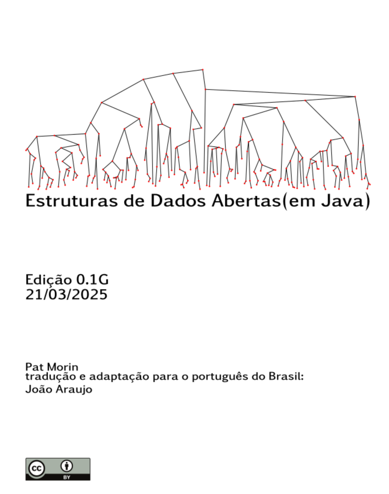

  

## Sobre o livro

Este livro é a tradução para o português do Brasil do livro *Open Data Structures* (em Java), escrito pelo professor **Pat Morin**, da Carleton University, no Canadá. O professor Morin generosamente disponibilizou o código-fonte do livro para uso e modificação, sob uma licença livre.

A versão em Java apresenta todas as estruturas de dados com implementações completas nessa linguagem, aproveitando os recursos da biblioteca padrão de Java e a orientação a objetos. Ideal para estudantes de cursos que utilizam Java como linguagem principal.

## Conteúdo

O livro aborda as seguintes estruturas de dados e temas:

- **Interfaces baseadas em arrays**: ArrayStack, ArrayQueue, ArrayDeque, DualArrayDeque, RootishArrayStack
- **Listas ligadas**: SLList, DLList, SEList
- **Skiplists**: SkiplistSSet, SkiplistList
- **Tabelas hash**: ChainedHashTable, LinearHashTable
- **Árvores binárias**: BinaryTree, BinarySearchTree, Treap, ScapegoatTree
- **Árvores balanceadas**: 2-4 Trees, RedBlackTree, B-Trees
- **Heaps**: BinaryHeap, MeldableHeap
- **Ordenação**: merge sort, quicksort, counting sort, radix sort
- **Grafos**: AdjacencyMatrix, AdjacencyLists, busca em largura (BFS), busca em profundidade (DFS)

Todos os exemplos de código são apresentados em **Java**, usando as interfaces `List`, `Set`, `Map` e outras da API de coleções de Java.

## Tradução

Se você encontrar algum erro na tradução, por favor, [entre em contato](#contact) para que possamos corrigir em futuras versões.
